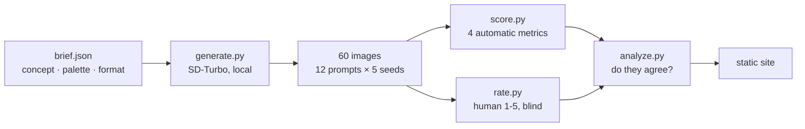

# creative-eval

[](https://github.com/berkaykoklu/creative-eval/actions/workflows/ci.yml)

**[Live site →](https://creative-eval.berkaykoklu.com)**

Generating ad creatives is a solved problem: one script, no money, sixty images
in ten minutes. **Deciding which ones deserve a media budget is the problem that
is left** — and it is the one a studio actually pays for.

This measures whether automatic quality scores agree with human judgement, and
reports the answer even when the answer is unflattering.

## The result

| Metric | Spearman ρ | Top-10 mean rating |
|---|---|---|
| CTA clarity | 0.59 | 2.70 |
| CLIP adherence | 0.22 | 2.60 |
| Brand colour | −0.05 | 2.00 |
| Distinctiveness | −0.35 | 1.70 |
| *Top-strip flatness (control)* | *0.69* | *3.30* |

Unfiltered mean over all 60: **2.23**.

Three things fell out of this, and the third is the one worth reading.

**Five lines of arithmetic beat a 600 MB model.** CTA clarity is a standard
deviation over a rectangle of pixels. CLIP adherence is a transformer trained on
400 million image-text pairs. On this set the arithmetic predicted my judgement
almost three times better.

**Filtering for distinctiveness actively hurts.** The ten images furthest from
every other image in CLIP space averaged 1.70 against a baseline of 2.23. An
outlier in a batch of generations is usually a failure, not an idea.

**The control beat the metric it was auditing — so the metric does not measure
what I said it measured.** CTA clarity came with a tidy rationale: mobile ads put
the install button in the bottom centre, so a busy strip there makes a creative
unusable. Running the identical arithmetic on the *top* strip, where there is no
button and no story, scored **0.69** against CTA clarity's 0.59. The metric was
detecting a visually calm image all along. The domain rationale was a story told
after the fact, and without the control it would have shipped as a finding.

## The question

If you generate creatives at scale, you cannot look at all of them. So you
filter automatically. But a filter is only worth running if it picks what a
person would have picked — and nobody checks that. This checks it.

## Pipeline



Generation and rating run **once, offline**; their output is committed. The site
only reads. No server, no database, no API key, and no cost per visitor.

## The four metrics

| Metric | How | What it catches |
|---|---|---|
| **CLIP adherence** | Cosine similarity of image and its own prompt in CLIP's shared embedding space | An image that is attractive but off-brief |
| **Brand colour** | Share of pixels within a fixed RGB distance of the palette | Drift off brand identity |
| **CTA clarity** | Flatness of the bottom-centre strip | Mobile ads put the install button there; a busy strip makes a creative unusable however good it looks |
| **Distinctiveness** | Inverted nearest-neighbour similarity across all images | Sixty renders are not sixty ideas |

Three are arithmetic over pixels. One is a small CLIP model. **No language model
judges anything** — whether an image matches its prompt is measurable, and
measuring beats asking.

Two metrics come from one model: the CLIP embeddings computed for adherence are
reused for the duplicate check, so the second metric costs nothing.

## Why the human ratings are collected blind

`rate.py` shows the image and the prompt, never the scores. Seeing a score first
would make the correlation measure how suggestible the rater was rather than
whether the metric works.

## Calibration happened before the ratings existed

Two constants set a threshold — `COLOR_TOLERANCE` and `BUSY_SCALE` — and a
threshold can kill a metric silently. The first pass used values that clamped
**21 of 60** images to an identical CTA score and left **18** at zero for brand
colour: a third of the set tied, with no ordering left to correlate against
anything.

`calibrate.py` prints the distribution each candidate value produces, and the
constants were chosen from it — not by preference, and **not by whether the
resulting correlation looked good**, because it was run before `ratings.json`
existed. That ordering is the difference between calibrating an instrument and
manufacturing a result.

| Metric | min | median | max |
|---|---|---|---|
| CLIP adherence | 0.274 | 0.316 | 0.364 |
| Brand colour | 0.001 | 0.092 | 0.450 |
| CTA clarity | 0.276 | 0.567 | 0.689 |
| Nearest other | 0.798 | 0.885 | 0.943 |

Every image is now rankable on every metric.

**One result is already visible here:** the nearest-neighbour column never drops
below 0.798. No creative in the set is far from every other one — sixty renders
from one brief are not sixty ideas.

## Honest limits

- **One rater, one brief, one model.** This measures whether *these* metrics
  track *my* judgement on *this* campaign. A second rater would give an
  inter-rater agreement figure this cannot.
- **60 images is small.** At this size a ρ of 0.2 is barely distinguishable
  from nothing; the ordering of the weak metrics should not be over-read.
- **Ratings are skewed** — 26 of 60 scored 1. Two-step SD-Turbo produces a lot
  of unusable output, so much of what the good metrics detect may be the
  difference between broken and coherent rather than between good and better.
- **`BUSY_SCALE` is calibrated, not derived.** It maps luminance spread onto
  0-1. A test proves flat beats noisy; the absolute value carries no meaning.
- **The palette was never put in the prompt.** So brand colour measures
  whether the palette turned up by chance, not whether the model followed an
  instruction. Injecting it into the brief would make this a
  did-it-comply metric, which is the more useful question.
- **RGB distance is not perceptual.** Two colours the same distance apart in RGB
  can look very different. LAB would be correct; this is not, and says so.
- Ratings are ordinal, so agreement is reported as Spearman ρ — rank agreement,
  not a straight line through the points.

## Run it

```bash
uv sync
uv run python generate.py   # ~10 min on an M-series Mac, once
uv run python score.py
uv run python calibrate.py   # evidence for the two thresholds
uv run python rate.py       # you, 60 images, ~10 min
uv run python analyze.py
uv run pytest

cd web && npm install && npm run dev
```

## Licence

MIT.
