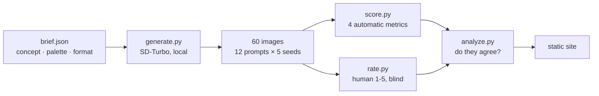

# creative-eval

Generating ad creatives is a solved problem: one script, no money, sixty images
in ten minutes. **Deciding which ones deserve a media budget is the problem that
is left** — and it is the one a studio actually pays for.

This measures whether automatic quality scores agree with human judgement, and
reports the answer even when the answer is unflattering.

## The question

If you generate creatives at scale, you cannot look at all of them. So you
filter automatically. But a filter is only worth running if it picks what a
person would have picked — and nobody checks that. This checks it.

## Pipeline



Generation and rating run **once, offline**; their output is committed. The site
only reads. No server, no database, no API key, and no cost per visitor.

## The four metrics

| Metric | How | What it catches |
|---|---|---|
| **CLIP adherence** | Cosine similarity of image and its own prompt in CLIP's shared embedding space | An image that is attractive but off-brief |
| **Brand colour** | Share of pixels within a fixed RGB distance of the palette | Drift off brand identity |
| **CTA clarity** | Flatness of the bottom-centre strip | Mobile ads put the install button there; a busy strip makes a creative unusable however good it looks |
| **Distinctiveness** | Inverted nearest-neighbour similarity across all images | Sixty renders are not sixty ideas |

Three are arithmetic over pixels. One is a small CLIP model. **No language model
judges anything** — whether an image matches its prompt is measurable, and
measuring beats asking.

Two metrics come from one model: the CLIP embeddings computed for adherence are
reused for the duplicate check, so the second metric costs nothing.

## Why the human ratings are collected blind

`rate.py` shows the image and the prompt, never the scores. Seeing a score first
would make the correlation measure how suggestible the rater was rather than
whether the metric works.

## Honest limits

- **One rater, one brief, one model.** This measures whether *these* metrics
  track *my* judgement on *this* campaign. A second rater would give an
  inter-rater agreement figure this cannot.
- **`BUSY_SCALE` is calibrated, not derived.** It maps luminance spread onto
  0-1. A test proves flat beats noisy; the absolute value carries no meaning.
- **RGB distance is not perceptual.** Two colours the same distance apart in RGB
  can look very different. LAB would be correct; this is not, and says so.
- Ratings are ordinal, so agreement is reported as Spearman ρ — rank agreement,
  not a straight line through the points.

## Run it

```bash
uv sync
uv run python generate.py   # ~10 min on an M-series Mac, once
uv run python score.py
uv run python rate.py       # you, 60 images, ~10 min
uv run python analyze.py
uv run pytest

cd web && npm install && npm run dev
```

## Licence

MIT.
